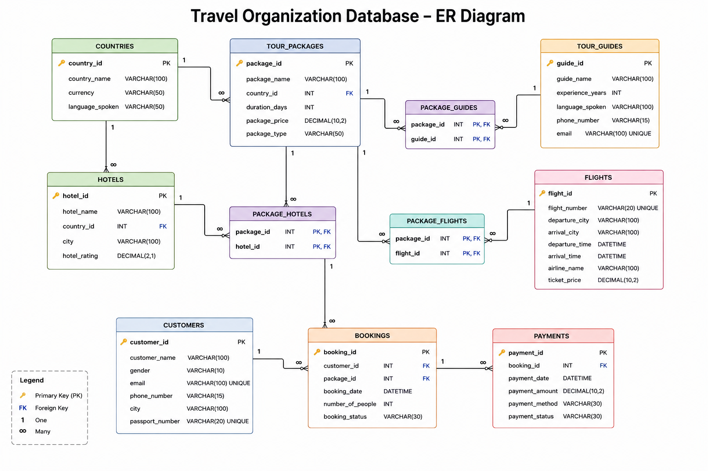

# Travel Organization Database

## Project Overview

The Travel Organization Database is a SQL-based relational database designed to manage the operations of a travel organization.

The database stores information about countries, tour packages, tour guides, hotels, flights, customers, bookings, and payments.

The project demonstrates relational database design and practical SQL queries for retrieving, analyzing, and reporting travel-related data.

## Database Schema

The database contains 11 related tables:

- countries
- tour_packages
- tour_guides
- package_guides
- hotels
- package_hotels
- flights
- package_flights
- customers
- bookings
- payments

The database uses primary keys and foreign keys to maintain relationships and data integrity.

Many-to-many relationships are implemented using junction tables such as:

- package_guides
- package_hotels
- package_flights

## ER Diagram

## Tables

| Table | Description |
|---|---|
| countries | Stores country, currency, and language information |
| tour_packages | Stores tour package details, duration, price, type, and country |
| tour_guides | Stores tour guide details and experience |
| package_guides | Maps tour packages to tour guides |
| hotels | Stores hotel details, city, country, and rating |
| package_hotels | Maps tour packages to hotels |
| flights | Stores flight, airline, route, timing, and price details |
| package_flights | Maps tour packages to flights |
| customers | Stores customer details and passport information |
| bookings | Stores customer bookings and booking status |
| payments | Stores payment details and payment status |

## SQL Concepts Used

- SELECT and filtering
- WHERE, AND, OR, IN, BETWEEN
- ORDER BY and LIMIT
- DISTINCT
- Aggregate functions: COUNT, SUM, AVG, MIN, MAX
- GROUP BY and HAVING
- INNER JOIN and LEFT JOIN
- Subqueries
- Common Table Expressions (CTEs)
- Window functions
- RANK()
- Date functions
- COALESCE()

## Key Business Queries

The project includes SQL queries to answer questions such as:

- Find the most expensive tour packages
- Find the average package price
- Find the total number of bookings
- Find total payment amount received
- Find customers who have not made payments
- Find packages without assigned guides
- Find the most booked package
- Find revenue generated by each package
- Find revenue generated country-wise
- Find hotels linked to multiple packages
- Find customers who booked multiple packages
- Find monthly booking trends
- Find the package generating the highest revenue
- Rank packages based on price and bookings

## Project Structure

travel-organization-database/

├── README.md

├── database/

│   ├── create_database.sql

│   ├── create_tables.sql

│   └── insert_data.sql

└── queries/

    └── queries.sql

## How to Run

1. Create the database by running `create_database.sql`.
2. Create all tables by running `create_tables.sql`.
3. Insert the sample data by running `insert_data.sql`.
4. Execute the queries from `queries.sql`.

The project is designed for MySQL.